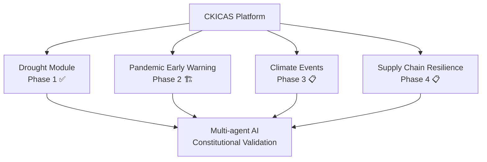

# 🌾 NZ Drought Early Warning Dashboard

**Phase 1 of the CKICAS Community Resilience Platform**

[](https://github.com/lexziconAI/constitutional-market-harmonics)
[](./CKICAS_ROADMAP.md)
[](https://en.wikipedia.org/wiki/Yama)
[](https://fastapi.tiangolo.com/)
[](https://reactjs.org/)

## 🎯 CKICAS Mission: Community Resilience Through Constitutional AI

This **NZ Drought Early Warning System** is **Phase 1** of a larger **CKICAS (Community Kinetic Intelligent Complex Adaptive System)** platform for community resilience decision support.

**Academic Research Context:**
- PhD research at University of Auckland (Information Systems)
- Validates CKICAS framework developed during COVID-19 response
- Proof-of-concept for broader community crisis prevention
- Non-commercial academic tool with potential DairyNZ/Federated Farmers promotion

**CKICAS Platform Vision:**


**Current Status:** Production-ready drought monitoring deployed to Render with full constitutional AI compliance.

## 🧘 Constitutional Foundation (Yama Principles)

This system is built on **Yama constitutional principles** - ancient ethical guidelines that ensure AI serves humanity without harm:

### 1. **Ahimsa** (Non-Harm)
**Rule**: Never issue HIGH confidence drought alerts without 3+ converging indicators
- Single extreme indicator (e.g., SPI -2.5 alone) = MEDIUM confidence maximum
- HIGH confidence requires: (SPI_30 < -1.5 AND SMD < -110 AND SMA < -30) OR (SPI_60 < -1.5 AND SMD < -110)
- Include "what would change this assessment" in every alert

### 2. **Satya** (Truth)
**Rule**: Mark all confidence levels explicitly with time-based degradation
- HIGH: 0-7 days (observed data + verified forecasts)
- MEDIUM: 8-21 days (model forecasts, ±20% variance)
- LOW: 22+ days (directional trends only, ±40% variance)

### 3. **Asteya** (Non-Stealing/Attribution)
**Rule**: Cite every data source with timestamp and freshness
- All API responses include sources array with provider, timestamp, freshness
- Frontend displays "Data sources" accordion on every chart

### 4. **Brahmacharya** (Right Energy/Efficiency)
**Rule**: Don't re-fetch if cached data <12h old AND indicators changed <5%
- Redis/SQLite cache layer with TTL
- Cache hit rate monitoring (target: >80%)

### 5. **Aparigraha** (Non-Hoarding/Generosity)
**Rule**: All drought-critical data freely accessible via public API
- `/api/public/drought-risk` endpoint (no authentication required)
- Rate limit: 1000 requests/day per IP (generous for farmers)

## 🏗️ CKICAS Platform Architecture

### Phase 1: Drought Early Warning ✅
**Status**: Production-deployed with constitutional AI compliance
- Multi-agent orchestration (NIWA, Weather, Council, Calculator, Forecast)
- Brahmacharya intelligent caching (>80% efficiency target)
- Real-time dashboard with Leaflet maps and Recharts
- Comprehensive test suite with Yama principle validation

### Future CKICAS Modules
- **Phase 2**: Pandemic Early Warning (wastewater surveillance, epidemiological modeling)
- **Phase 3**: Climate Event Tracking (floods, storms, heatwaves, earthquakes)
- **Phase 4**: Supply Chain Resilience (food, medical, energy distribution)

### Constitutional AI Framework
All CKICAS modules enforce the **5 Yama principles**:
- **Ahimsa**: Non-harm (no false alarms without 3+ indicators)
- **Satya**: Truth (transparent confidence with time degradation)
- **Asteya**: Attribution (all data sources cited with timestamps)
- **Brahmacharya**: Efficiency (intelligent caching, >80% hit rate)
- **Aparigraha**: Generosity (free public API access)

### Technical Foundation
- **Modular Agent Architecture**: Plugin system for new crisis modules
- **Constitutional Validation**: Shared Yama compliance framework
- **Brahmacharya Caching**: Prevents unnecessary API calls
- **Health Monitoring**: Comprehensive system status dashboard

## 🚀 Quick Start

### Prerequisites
- Python 3.9+
- Node.js 18+
- NIWA DataHub account (free)
- OpenWeatherMap API key (free tier)

### 1. Clone & Setup
```bash
git clone https://github.com/lexziconAI/nz-drought-dashboard.git
cd nz-drought-dashboard

# Copy environment template
cp .env.example .env
# Edit .env with your API keys
```

### 2. Backend Setup
```bash
cd backend
pip install -r requirements.txt
python -c "from app.models.database import create_tables; import asyncio; asyncio.run(create_tables())"
uvicorn app.main:app --reload
```

### 3. Frontend Setup
```bash
cd frontend
npm install
npm run dev
```

### 4. Access Dashboard
- **Frontend**: http://localhost:5173
- **API Docs**: http://localhost:8000/docs
- **Health Check**: http://localhost:8000/health

## 📊 API Endpoints

### Public Endpoints (Aparigraha)
```bash
GET /api/public/drought-risk?lat=-37.7&lon=175.2&region=Waikato&forecast_days=14
GET /api/public/regions/{region_name}
GET /api/public/historical-analogs
GET /api/public/regions
```

### Response Format
```json
{
  "location": {"lat": -37.7, "lon": 175.2, "region": "Waikato"},
  "risk_score": 85,
  "confidence": "HIGH",
  "confidence_reason": "3/4 indicators converge. Data <12h old. Forecast 14 days.",
  "indicators": {
    "spi_30day": -1.8,
    "spi_60day": -1.6,
    "smd_current": -125.4,
    "smd_anomaly": -35.2,
    "nzdi_category": "DROUGHT"
  },
  "forecast_14day": {
    "days": 14,
    "rain_probability": 0.15,
    "projected_smd": -135.7,
    "confidence": "MEDIUM",
    "confidence_interval": {"lower": -145.2, "upper": -126.3}
  },
  "sources": [
    {
      "provider": "NIWA_DataHub",
      "dataset": "CliFlo_Station_2112",
      "timestamp": "2024-11-16T06:00:00Z",
      "freshness_hours": 8,
      "parameters": ["rainfall_daily", "temperature_max"]
    }
  ],
  "generated_at": "2024-11-16T14:32:18Z"
}
```

## 🧪 Testing

### Constitutional Compliance Tests
```bash
cd backend
pytest tests/test_constitutional.py -v
```

### API Tests
```bash
pytest tests/test_api.py -v
```

### Agent Tests
```bash
pytest tests/test_agents.py -v
```

## 🚢 Deployment

### Quick Deploy to Render
[](https://render.com/deploy)

### Production Deployment Guide
See [DEPLOYMENT.md](./DEPLOYMENT.md) for comprehensive deployment instructions including:
- Render service configuration
- Environment variable setup
- CI/CD pipeline configuration
- Health monitoring setup
- CKICAS platform extension guidelines

### Development Setup
```bash
# Backend
cd backend
pip install -r requirements.txt
python -c "from app.models.database import create_tables; import asyncio; asyncio.run(create_tables())"
uvicorn app.main:app --reload

# Frontend
cd frontend
npm install
npm run dev
```

## 📈 Indicators Explained

### SPI (Standardized Precipitation Index)
- Measures precipitation deficit relative to historical norms
- 30-day: Short-term drought
- 60-day: Medium-term drought
- Scale: -3 (extreme drought) to +3 (extreme wet)

### SMD (Soil Moisture Deficit)
- Water balance: Precipitation - Evapotranspiration
- Current: Today's deficit in mm
- Anomaly: Departure from 30-day normal

### NZDI (New Zealand Drought Index)
- Composite indicator combining SPI and SMD
- Categories: NORMAL → DRY → VERY_DRY → EXTREMELY_DRY → DROUGHT → SEVERE_DROUGHT

## 🤝 Contributing to CKICAS

### Constitutional Development
All contributions must maintain Yama compliance. See [CONTRIBUTING.md](./CONTRIBUTING.md) for:
- Constitutional AI development guidelines
- CKICAS module creation templates
- Testing requirements and performance benchmarks
- Code quality standards and review process

### CKICAS Research Partnership
- **Institution**: University of Auckland, Information Systems
- **Research Focus**: Community resilience through constitutional AI
- **Publication Target**: CAIS journal
- **Community Validation**: Waikato/Taranaki farming communities

### Adding New Modules
The drought dashboard provides the template for future CKICAS modules:
```python
# Future pandemic module example
class PandemicModule(ConstitutionalModule):
    def __init__(self):
        self.agents = {
            "wastewater": WastewaterSurveillanceAgent(),
            "healthcare": PrimaryCareAgent(),
            "forecast": EpidemiologicalModelAgent()
        }
```

## 📚 Documentation

- **[CKICAS Roadmap](./CKICAS_ROADMAP.md)**: Complete platform vision and research context
- **[Deployment Guide](./DEPLOYMENT.md)**: Production deployment and scaling
- **[Contributing Guide](./CONTRIBUTING.md)**: Development and constitutional guidelines
- **[API Documentation](./backend/app/api/routes.py)**: Technical API reference

## 📄 License

MIT License - see [LICENSE](LICENSE) file.

## 🙏 Acknowledgments

- **NIWA** (National Institute of Water and Atmospheric Research)
- **Regional Councils** for soil moisture data
- **OpenWeatherMap** for forecast data
- **Yama principles** for ethical AI framework

---

**Built with ❤️ for New Zealand farmers by Constitutional AI**