# Comprehensive System Architecture Documentation

Generated by 50 Specialized Architecture Workers
Date: 2025-10-29 20:25:59

## Overview

This document contains comprehensive system architecture diagrams for the LOG⁴ v2.3 framework with massive fractal worker deployment, real LLM debate integration, and autonomous learning capabilities.

## Architecture Diagrams Included

1. **LOG⁴ Framework Architecture** - Overall system framework with constitutional layer integration
2. **Community Decision Process Flow** - Community engagement and proxy evidence framework
3. **13-Gate Validation Architecture** - Comprehensive validation system with 80 specialized workers
4. **Autonomous Learning Flow** - Real-time learning and optimization system
5. **Infrastructure Coordination Map** - 200+ worker deployment and coordination architecture

## Constitutional Framework

All architectures operate under the Yama principles:
- **Satya (Truth)**: Truthful architectural representation and accurate system modeling
- **Asteya (Attribution)**: Proper attribution of all architectural components and worker contributions
- **Ahimsa (Harm Prevention)**: Community protection and ethical system design

## Worker Integration

Each architecture diagram reflects insights from:
- 8 Real LLM Debate Perspectives
- 88 Massive Samadhi Shards
- 200+ Specialized Workers across 3 main categories
- Constitutional AI compliance monitoring

---

## Log4 Framework Architecture

```mermaid
graph TB
    subgraph "LOG⁴ v2.3 Framework Architecture"
        subgraph "Constitutional Layer"
            SATYA[🏛️ Satya - Truth Validation]
            ASTEYA[🏛️ Asteya - Attribution Compliance]
            AHIMSA[🏛️ Ahimsa - Harm Prevention]
        end
        
        subgraph "Fractal Worker Orchestration"
            FWS[🚀 Fractal Worker Spawner]
            AWD[⚡ Advanced Worker Deployer]
            IWC[🔄 Infrastructure Worker Coordinator]
            
            FWS --> AWD
            AWD --> IWC
        end
        
        subgraph "Specialized Worker Armies"
            subgraph "Architecture Workers (50)"
                SA[📐 System Architects - 12]
                CPV[📐 Community Process Visualizers - 10]
                TIM[📐 Technical Infrastructure Mappers - 8]
                VSA[📐 Validation System Architects - 8]
                AWD_SUB[📐 Academic Workflow Designers - 6]
                IFM[📐 Innovation Flow Mappers - 6]
            end
            
            subgraph "Validation Workers (80)"
                CCV[✅ Constitutional Compliance - 15]
                ARA[✅ Academic Rigor Assessors - 12]
                CRM[✅ Community Respect Monitors - 10]
                TQA[✅ Technical Quality Assurance - 10]
                CAS[✅ CFP Alignment Specialists - 8]
                SCA[✅ Systems Coherence Assessors - 8]
                IAV[✅ Innovation Authenticity - 6]
                SE[✅ Sustainability Evaluators - 6]
                FIO[✅ Final Integration Orchestrators - 5]
            end
            
            subgraph "Learning Workers (70)"
                PRS[🧠 Pattern Recognition Specialists - 15]
                QOE[🧠 Quickstart Optimization Engine - 12]
                MCS[🧠 Markdown Consolidation - 10]
                PCE[🧠 Python Code Enhancers - 10]
                JOE[🧠 JSON Optimization Engine - 8]
                IEC[🧠 Insight Emergence Catalysts - 6]
                CFI[🧠 Community Feedback Integrators - 5]
                SOM[🧠 Sustainability Optimization - 4]
            end
        end
        
        subgraph "Real LLM Debate Integration"
            PI[🎯 Pragmatic Implementation]
            TR[🎯 Theoretical Rigor]
            CE[🎯 Community Empowerment]
            IE[🎯 Innovation Emergence]
            SI[🎯 Systems Integration]
            EF[🎯 Ethical Framework]
            EO[🎯 Efficiency Optimization]
            LTS[🎯 Long-term Sustainability]
        end
        
        subgraph "Massive Samadhi Sharding (88 Shards)"
            WC[🧠 Wisdom Consolidation - 16]
            PR[🧠 Pattern Recognition - 12]
            IS[🧠 Integration Synthesis - 10]
            LO[🧠 Learning Optimization - 8]
            MC[🧠 Memory Consolidation - 8]
            IE_SHARD[🧠 Insight Emergence - 6]
            TV[🧠 Truth Validation - 6]
            IC[🧠 Innovation Catalysis - 6]
            CI[🧠 Community Integration - 4]
            EE[🧠 Efficiency Enhancement - 4]
            SM[🧠 Sustainability Modeling - 4]
            EM[🧠 Ethical Monitoring - 4]
        end
        
        subgraph "Output Generation"
            MANUSCRIPT[📄 CAIS Complete Manuscript]
            DIAGRAMS[🗺️ Architecture Diagrams]
            VALIDATION[✅ 13-Gate Validation Report]
            LEARNING[🧠 Autonomous Learning Integration]
        end
    end
    
    %% Constitutional Layer Integration
    SATYA --> FWS
    ASTEYA --> FWS
    AHIMSA --> FWS
    
    %% Worker Coordination
    IWC --> SA
    IWC --> CPV
    IWC --> TIM
    IWC --> VSA
    IWC --> AWD_SUB
    IWC --> IFM
    
    %% Debate Integration
    PI --> SA
    TR --> AWD_SUB
    CE --> CPV
    IE --> IFM
    SI --> VSA
    EF --> CCV
    EO --> TIM
    LTS --> SE
    
    %% Samadhi Coordination
    WC --> IWC
    PR --> PRS
    IS --> FIO
    LO --> QOE
    MC --> MCS
    IE_SHARD --> IEC
    TV --> CCV
    IC --> IAV
    CI --> CFI
    EE --> PCE
    SM --> SOM
    EM --> CCV
    
    %% Output Generation
    SA --> DIAGRAMS
    VSA --> VALIDATION
    PRS --> LEARNING
    CCV --> MANUSCRIPT
    
    classDef constitutional fill:#e1f5fe,stroke:#01579b,stroke-width:3px
    classDef worker fill:#f3e5f5,stroke:#4a148c,stroke-width:2px
    classDef debate fill:#fff3e0,stroke:#e65100,stroke-width:2px
    classDef samadhi fill:#e8f5e8,stroke:#1b5e20,stroke-width:2px
    classDef output fill:#fce4ec,stroke:#880e4f,stroke-width:3px
    
    class SATYA,ASTEYA,AHIMSA constitutional
    class SA,CPV,TIM,VSA,AWD_SUB,IFM,CCV,ARA,CRM,TQA,CAS,SCA,IAV,SE,FIO,PRS,QOE,MCS,PCE,JOE,IEC,CFI,SOM worker
    class PI,TR,CE,IE,SI,EF,EO,LTS debate
    class WC,PR,IS,LO,MC,IE_SHARD,TV,IC,CI,EE,SM,EM samadhi
    class MANUSCRIPT,DIAGRAMS,VALIDATION,LEARNING output
```

## Community Process Architecture

```mermaid
flowchart TD
    subgraph "Community Decision Process Architecture"
        subgraph "Episode Identification"
            EID[🔍 Episode Identification]
            CDP[📋 Community Decision Point]
            KC[🏘️ Kinetic Community Indicators]
        end
        
        subgraph "Proxy Evidence Framework"
            subgraph "11 Proxy Families"
                PF1[📊 Social Cohesion Indicators]
                PF2[📊 Economic Adaptation Patterns]
                PF3[📊 Communication Network Changes]
                PF4[📊 Resource Allocation Shifts]
                PF5[📊 Leadership Emergence Patterns]
                PF6[📊 Cultural Practice Adaptations]
                PF7[📊 Collective Problem-Solving]
                PF8[📊 Resilience Building Activities]
                PF9[📊 Innovation Adoption Rates]
                PF10[📊 Intergenerational Knowledge Transfer]
                PF11[📊 External Relationship Management]
            end
            
            subgraph "Episode Evidence Packs (EEPs)"
                EEP1[📦 COVID Response Coordination]
                EEP2[📦 Remote Learning Implementation]
                EEP3[📦 Community Support Networks]
                EEP4[📦 Economic Adaptation Strategies]
            end
        end
        
        subgraph "Constitutional Analysis Framework"
            NCL[🏛️ Non-Causal Language Enforcement]
            CAP[🏛️ Community Agency Preservation]
            CR[🏛️ Cultural Responsiveness]
            PA[🏛️ Proper Attribution]
        end
        
        subgraph "Academic Integration"
            AV[📚 Academic Vignettes]
            PE[📊 Proxy Evidence Tables]
            SA[📈 Statistical Analysis]
            MIC[📄 Manuscript Integration]
        end
        
        subgraph "Quality Assurance"
            CR_VAL[✅ Community Respect Validation]
            AA[✅ Academic Accuracy]
            EC[✅ Ethical Compliance]
            CC[✅ Constitutional Compliance]
        end
    end
    
    %% Process Flow
    EID --> CDP
    CDP --> KC
    KC --> PF1
    KC --> PF2
    KC --> PF3
    KC --> PF4
    KC --> PF5
    KC --> PF6
    KC --> PF7
    KC --> PF8
    KC --> PF9
    KC --> PF10
    KC --> PF11
    
    PF1 --> EEP1
    PF2 --> EEP2
    PF3 --> EEP3
    PF4 --> EEP4
    
    EEP1 --> NCL
    EEP2 --> CAP
    EEP3 --> CR
    EEP4 --> PA
    
    NCL --> AV
    CAP --> PE
    CR --> SA
    PA --> MIC
    
    AV --> CR_VAL
    PE --> AA
    SA --> EC
    MIC --> CC
    
    classDef episode fill:#e3f2fd,stroke:#0277bd,stroke-width:2px
    classDef proxy fill:#f1f8e9,stroke:#33691e,stroke-width:2px
    classDef constitutional fill:#fce4ec,stroke:#880e4f,stroke-width:2px
    classDef academic fill:#fff8e1,stroke:#f57f17,stroke-width:2px
    classDef quality fill:#e8f5e8,stroke:#2e7d32,stroke-width:2px
    
    class EID,CDP,KC episode
    class PF1,PF2,PF3,PF4,PF5,PF6,PF7,PF8,PF9,PF10,PF11,EEP1,EEP2,EEP3,EEP4 proxy
    class NCL,CAP,CR,PA constitutional
    class AV,PE,SA,MIC academic
    class CR_VAL,AA,EC,CC quality
```

## Validation Gates Architecture

```mermaid
graph LR
    subgraph "13-Gate Validation System Architecture"
        subgraph "Input Processing"
            INPUT[📄 CAIS Manuscript Input]
            PARSE[🔍 Content Parser]
            SEGMENT[📋 Section Segmentation]
        end
        
        subgraph "Constitutional Gates (Gates 1-4)"
            G1[🏛️ Gate 1: Satya Truth Validation]
            G2[🏛️ Gate 2: Asteya Attribution Check]
            G3[🏛️ Gate 3: Ahimsa Harm Assessment]
            G4[🏛️ Gate 4: Constitutional Integration]
        end
        
        subgraph "Academic Rigor Gates (Gates 5-7)"
            G5[📚 Gate 5: Citation Accuracy]
            G6[📚 Gate 6: Methodological Soundness]
            G7[📚 Gate 7: Statistical Validation]
        end
        
        subgraph "Community Respect Gates (Gates 8-9)"
            G8[🏘️ Gate 8: Community Agency Preservation]
            G9[🏘️ Gate 9: Cultural Responsiveness]
        end
        
        subgraph "Technical Quality Gates (Gates 10-11)"
            G10[⚙️ Gate 10: Technical Implementation]
            G11[⚙️ Gate 11: System Coherence]
        end
        
        subgraph "Final Integration Gates (Gates 12-13)"
            G12[🎯 Gate 12: CFP Alignment Verification]
            G13[✅ Gate 13: Ready-for-Submission Certification]
        end
        
        subgraph "Validation Workers"
            CCV[👥 Constitutional Compliance - 15 workers]
            ARA[👥 Academic Rigor - 12 workers]
            CRM[👥 Community Respect - 10 workers]
            TQA[👥 Technical Quality - 10 workers]
            CAS[👥 CFP Alignment - 8 workers]
            FIO[👥 Final Integration - 5 workers]
        end
        
        subgraph "Output Generation"
            PASS[✅ Validation Passed]
            FAIL[❌ Validation Failed]
            REPORT[📊 Detailed Validation Report]
            RECOMMENDATIONS[📋 Improvement Recommendations]
        end
    end
    
    %% Processing Flow
    INPUT --> PARSE
    PARSE --> SEGMENT
    
    %% Constitutional Gates
    SEGMENT --> G1
    G1 --> G2
    G2 --> G3
    G3 --> G4
    
    %% Academic Gates
    G4 --> G5
    G5 --> G6
    G6 --> G7
    
    %% Community Gates
    G7 --> G8
    G8 --> G9
    
    %% Technical Gates
    G9 --> G10
    G10 --> G11
    
    %% Final Gates
    G11 --> G12
    G12 --> G13
    
    %% Worker Assignment
    CCV --> G1
    CCV --> G2
    CCV --> G3
    CCV --> G4
    
    ARA --> G5
    ARA --> G6
    ARA --> G7
    
    CRM --> G8
    CRM --> G9
    
    TQA --> G10
    TQA --> G11
    
    CAS --> G12
    FIO --> G13
    
    %% Output Routing
    G13 --> PASS
    G1 --> FAIL
    G2 --> FAIL
    G3 --> FAIL
    G4 --> FAIL
    G5 --> FAIL
    G6 --> FAIL
    G7 --> FAIL
    G8 --> FAIL
    G9 --> FAIL
    G10 --> FAIL
    G11 --> FAIL
    G12 --> FAIL
    
    PASS --> REPORT
    FAIL --> REPORT
    REPORT --> RECOMMENDATIONS
    
    classDef input fill:#e1f5fe,stroke:#01579b,stroke-width:2px
    classDef constitutional fill:#fce4ec,stroke:#880e4f,stroke-width:3px
    classDef academic fill:#fff8e1,stroke:#f57f17,stroke-width:2px
    classDef community fill:#e8f5e8,stroke:#2e7d32,stroke-width:2px
    classDef technical fill:#f3e5f5,stroke:#4a148c,stroke-width:2px
    classDef final fill:#fff3e0,stroke:#e65100,stroke-width:3px
    classDef workers fill:#f1f8e9,stroke:#33691e,stroke-width:2px
    classDef output fill:#e0f2f1,stroke:#00695c,stroke-width:2px
    
    class INPUT,PARSE,SEGMENT input
    class G1,G2,G3,G4 constitutional
    class G5,G6,G7 academic
    class G8,G9 community
    class G10,G11 technical
    class G12,G13 final
    class CCV,ARA,CRM,TQA,CAS,FIO workers
    class PASS,FAIL,REPORT,RECOMMENDATIONS output
```

## Autonomous Learning Architecture

## Infrastructure Coordination Architecture

