# Community Process Architecture

Generated by 50 specialized architecture workers on 2025-10-29 20:25:59

```mermaid
flowchart TD
    subgraph "Community Decision Process Architecture"
        subgraph "Episode Identification"
            EID[🔍 Episode Identification]
            CDP[📋 Community Decision Point]
            KC[🏘️ Kinetic Community Indicators]
        end
        
        subgraph "Proxy Evidence Framework"
            subgraph "11 Proxy Families"
                PF1[📊 Social Cohesion Indicators]
                PF2[📊 Economic Adaptation Patterns]
                PF3[📊 Communication Network Changes]
                PF4[📊 Resource Allocation Shifts]
                PF5[📊 Leadership Emergence Patterns]
                PF6[📊 Cultural Practice Adaptations]
                PF7[📊 Collective Problem-Solving]
                PF8[📊 Resilience Building Activities]
                PF9[📊 Innovation Adoption Rates]
                PF10[📊 Intergenerational Knowledge Transfer]
                PF11[📊 External Relationship Management]
            end
            
            subgraph "Episode Evidence Packs (EEPs)"
                EEP1[📦 COVID Response Coordination]
                EEP2[📦 Remote Learning Implementation]
                EEP3[📦 Community Support Networks]
                EEP4[📦 Economic Adaptation Strategies]
            end
        end
        
        subgraph "Constitutional Analysis Framework"
            NCL[🏛️ Non-Causal Language Enforcement]
            CAP[🏛️ Community Agency Preservation]
            CR[🏛️ Cultural Responsiveness]
            PA[🏛️ Proper Attribution]
        end
        
        subgraph "Academic Integration"
            AV[📚 Academic Vignettes]
            PE[📊 Proxy Evidence Tables]
            SA[📈 Statistical Analysis]
            MIC[📄 Manuscript Integration]
        end
        
        subgraph "Quality Assurance"
            CR_VAL[✅ Community Respect Validation]
            AA[✅ Academic Accuracy]
            EC[✅ Ethical Compliance]
            CC[✅ Constitutional Compliance]
        end
    end
    
    %% Process Flow
    EID --> CDP
    CDP --> KC
    KC --> PF1
    KC --> PF2
    KC --> PF3
    KC --> PF4
    KC --> PF5
    KC --> PF6
    KC --> PF7
    KC --> PF8
    KC --> PF9
    KC --> PF10
    KC --> PF11
    
    PF1 --> EEP1
    PF2 --> EEP2
    PF3 --> EEP3
    PF4 --> EEP4
    
    EEP1 --> NCL
    EEP2 --> CAP
    EEP3 --> CR
    EEP4 --> PA
    
    NCL --> AV
    CAP --> PE
    CR --> SA
    PA --> MIC
    
    AV --> CR_VAL
    PE --> AA
    SA --> EC
    MIC --> CC
    
    classDef episode fill:#e3f2fd,stroke:#0277bd,stroke-width:2px
    classDef proxy fill:#f1f8e9,stroke:#33691e,stroke-width:2px
    classDef constitutional fill:#fce4ec,stroke:#880e4f,stroke-width:2px
    classDef academic fill:#fff8e1,stroke:#f57f17,stroke-width:2px
    classDef quality fill:#e8f5e8,stroke:#2e7d32,stroke-width:2px
    
    class EID,CDP,KC episode
    class PF1,PF2,PF3,PF4,PF5,PF6,PF7,PF8,PF9,PF10,PF11,EEP1,EEP2,EEP3,EEP4 proxy
    class NCL,CAP,CR,PA constitutional
    class AV,PE,SA,MIC academic
    class CR_VAL,AA,EC,CC quality
```

---
Constitutional Framework: Truth in architectural representation with community protection
Worker Integration: Real LLM debate insights + systems integration perspective wisdom
